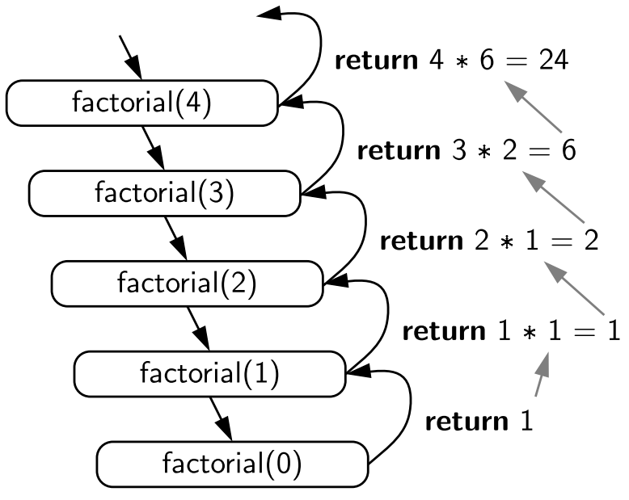

 # Рекурсия — это когда функция вызывает сама себя, чтобы решить более простую версию той же задачи. Обычно рекурсия используется для решения задач, которые можно разбить на похожие подзадачи.

 ## Представь, что у тебя есть задача — пересчитать количество коробок в стопке. Ты можешь:

Посчитать верхнюю коробку.
Сказать: «Я пересчитаю оставшиеся коробки в стопке».
Функция делает то же самое:

Выполняет маленькую часть задачи (считает одну коробку).
Вызывает сама себя, чтобы выполнить оставшуюся часть задачи.
Рекурсия всегда должна иметь условие выхода, чтобы функция знала, когда остановиться (иначе получится бесконечный цикл).

       function factorial(n) {
           if (n === 1) {
               return 1; // Условие выхода
            }
            return n * factorial(n - 1); // Рекурсивный вызов
            }

     console.log(factorial(5)); // Результат: 120 (5 * 4 * 3 * 2 * 1)

# Важные моменты:
    Условие выхода обязательно. Без него рекурсия зацикливается и вызывает ошибку.
    Разбиение задачи: на каждом шаге рекурсия должна решать более простую часть задачи.
Рекурсия удобна для задач, связанных с деревьями, вложенными структурами, или математическими задачами вроде факториалов и последовательностей.

# Closure

# Замыкание (closure) — это функция, которая «запоминает» свою внешнюю область видимости (контекст), даже если она вызывается вне этой области.

# Простое объяснение
Представь, что ты работаешь с коробкой, в которой есть вещи. Замыкание — это как ключ к коробке: ты можешь открыть её и взять оттуда вещи, даже если уже отошёл далеко от места, где коробка была создана.

Замыкание позволяет функции запомнить переменные, которые были объявлены рядом с ней в момент создания, и использовать их позже, даже если функция выполняется в другом месте.

    function createCounter() {
      let count = 0; // Переменная из внешней области видимости
  
      return function () {
        count++; // Используем переменную из внешней области
        return count;
      };
    }

    const counter = createCounter(); // Создаём замыкание
    console.log(counter()); // 1
    console.log(counter()); // 2
    console.log(counter()); // 3

#
    function makeMultiplier(multiplier) {
      return function (num) {
        return num * multiplier; // Используем переменную из внешней области
      };
    }

    const double = makeMultiplier(2); // Замыкание, multiplier = 2
    const triple = makeMultiplier(3); // Замыкание, multiplier = 3

    console.log(double(5)); // 10
    console.log(triple(5)); // 15

# Когда использовать замыкания?
## Сохранение состояния: Как в счётчике или таймере.
## Инкапсуляция данных: Чтобы скрыть внутренние переменные (например, в модулях).
Замыкания — это мощный инструмент, который делает JavaScript гибким для работы с состоянием и логикой.

